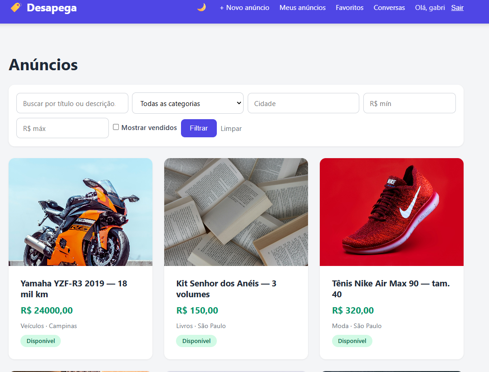
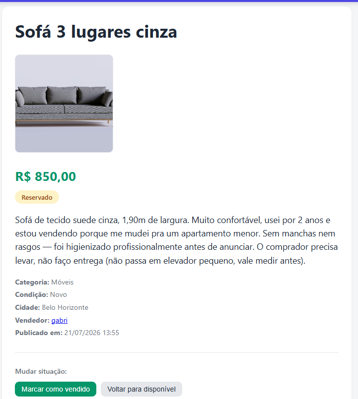
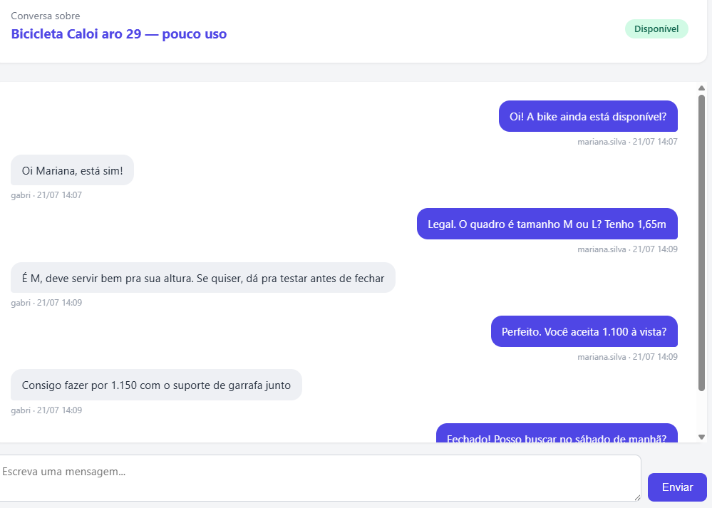
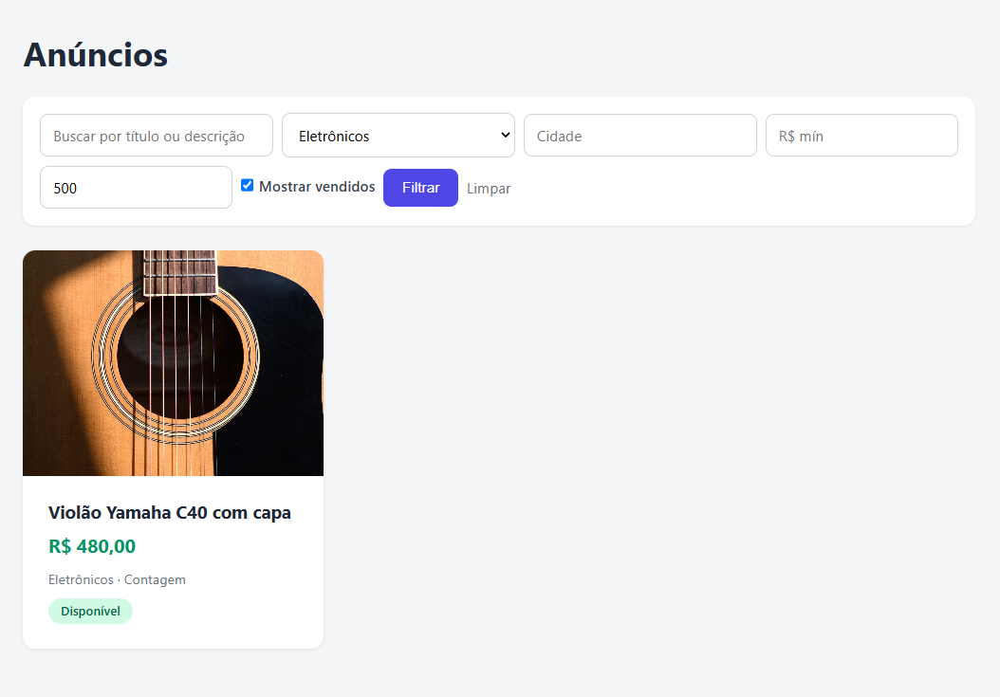
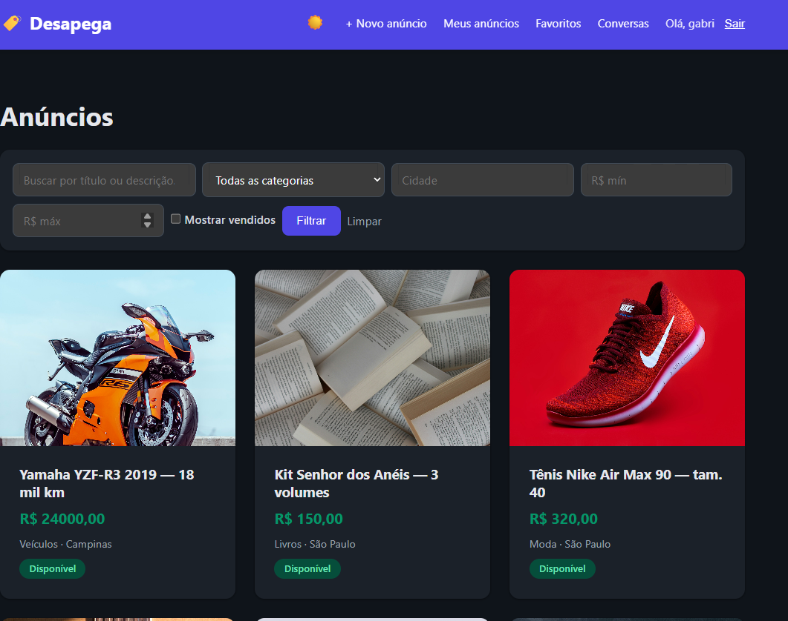

# 🛍️ Desapega — Marketplace de Classificados

Um marketplace de classificados no estilo "OLX-lite", onde qualquer pessoa navega
e busca anúncios, e usuários cadastrados publicam seus próprios itens à venda com
fotos, e controlam o ciclo de vida do anúncio (disponível → reservado → vendido).

Projeto de estudo focado em **conteúdo gerado pelo usuário**, **upload de mídia na
nuvem** e **regras de permissão** — indo além do padrão "consumir uma API externa".


---

## ✨ Funcionalidades

- 🔐 **Autenticação** — cadastro, login e logout (auth nativo do Django).
- 📝 **CRUD de anúncios** — criar, editar e apagar, com **proteção de dono**
  (só quem publicou pode alterar).
- 🗂️ **"Meus anúncios"** — cada usuário vê e gerencia os seus.
- 📷 **Fotos na nuvem (AWS S3)** — upload de múltiplas imagens por anúncio,
  servidas via **URLs assinadas** (bucket privado).
- 🔎 **Busca e filtros** — por texto (título/descrição), categoria, cidade e
  faixa de preço, com **paginação**.
- 🏷️ **Máquina de estados** — o dono marca o anúncio como *disponível*,
  *reservado* ou *vendido*, com badges visuais; vendidos ficam escondidos da
  home por padrão (com opção de mostrar).
- 💬 **Chat comprador ↔ vendedor** — uma conversa por anúncio, com envio de
  mensagens **sem recarregar a página** (HTMX) e **contador de não lidas** no
  menu.
- ❤️ **Favoritos** — salvar anúncios de outros usuários numa lista própria.
- 👤 **Perfil público do vendedor** — página com os anúncios ativos de cada um.
- 🌙 **Modo claro/escuro** — alternado por botão, com a escolha salva no
  `localStorage` (sem flash ao recarregar).
- ✅ **Testes automatizados** — cobertura dos filtros de busca e das guardas de
  permissão (`python manage.py test anuncios`).

### 🔭 Fora do escopo desta versão
Deploy em produção e API REST (DRF) + frontend React — ambos possíveis
evoluções, mas o objetivo aqui era um marketplace completo em Django full-stack.

---

## 🛠️ Tecnologias

| Camada        | Ferramenta                                        |
|---------------|---------------------------------------------------|
| Backend       | Python 3.13, Django 5.2                           |
| Banco (dev)   | SQLite                                            |
| Mídia         | AWS S3 (`django-storages` + `boto3`), URLs assinadas |
| Frontend      | Templates Django + CSS (sem framework) + HTMX no chat |
| Config        | `python-dotenv` (variáveis de ambiente via `.env`) |
| Testes        | `unittest` via `manage.py test`                   |

---

## 🚀 Como rodar localmente

**Pré-requisitos:** Python 3.13+ e uma conta AWS com um bucket S3 (para as fotos).

```bash
# 1. Clonar o repositório
git clone https://github.com/gabrielbastosg/desapega.git
cd desapega

# 2. Criar e ativar um ambiente virtual
python -m venv .venv
# Windows:
.venv\Scripts\activate
# Linux/Mac:
source .venv/bin/activate

# 3. Instalar as dependências
pip install -r requirements.txt

# 4. Configurar as variáveis de ambiente
# Copie o modelo e preencha com suas credenciais AWS:
copy .env.example .env      # Windows
# cp .env.example .env      # Linux/Mac

# 5. Preparar o banco e criar um usuário admin
python manage.py migrate
python manage.py createsuperuser

# 6. Rodar o servidor
python manage.py runserver
```

Acesse **http://127.0.0.1:8000/** — e o admin em **/admin/**.

> ⚠️ As credenciais AWS ficam **apenas** no `.env` (que **nunca** vai para o Git).
> Use o `.env.example` como referência do que preencher.

---

## 📸 Screenshots

**Home — busca, filtros e listagem**



**Detalhe do anúncio — fotos do S3, situação e ações do dono**



**Chat comprador ↔ vendedor (HTMX, sem recarregar a página)**



**Filtros aplicados — categoria + faixa de preço**



**Modo escuro**



> As imagens dos anúncios são ilustrativas, do [Unsplash](https://unsplash.com).

---

## 📁 Estrutura do projeto

```
desapega/
├── config/                  # projeto Django (settings, urls, wsgi)
├── anuncios/                # app principal
│   ├── models.py            # Categoria, Anuncio, Foto, Conversa, Mensagem, Favorito
│   ├── views.py             # CRUD, busca/filtros, máquina de estados, chat, favoritos
│   ├── forms.py             # AnuncioForm + FiltroForm (valida a query string)
│   ├── context_processors.py# contador de mensagens não lidas
│   ├── admin.py
│   ├── tests.py             # filtros de busca e guardas de permissão
│   ├── urls.py
│   ├── templates/           # HTML (base, lista, detalhe, chat, perfil, auth)
│   └── static/              # CSS separado em base / anuncios / chat
├── docs/screenshots/        # imagens usadas neste README
├── requirements.txt
├── .env.example             # modelo das variáveis de ambiente
└── manage.py
```

---

## 🧪 Rodando os testes

```bash
python manage.py test anuncios
```

---

## 📚 Sobre

Projeto de portfólio construído para praticar Django full-stack e integração com
serviços de nuvem (AWS S3), com atenção a boas práticas de segurança (credenciais
fora do código, bucket privado, usuário IAM com permissão mínima).

Diferente dos projetos que só consomem uma API externa, aqui **o conteúdo é dos
próprios usuários** — o que trouxe problemas mais interessantes: upload de mídia,
permissões de dono, ciclo de vida de um anúncio e comunicação entre duas pessoas
dentro do sistema.
